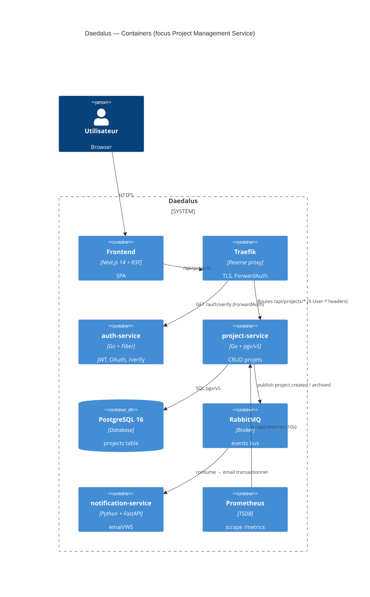

# C4 — Niveau 2 : Containers (project-service en focus)

```mermaid
C4Container
    title Daedalus — Containers (focus Project Management Service)

    Person(user, "Utilisateur", "Browser")

    System_Boundary(daedalus, "Daedalus") {
        Container(frontend, "Frontend",        "Next.js 14 + R3F", "SPA")
        Container(traefik,  "Traefik",         "Reverse proxy",    "TLS, ForwardAuth")
        Container(auth,     "auth-service",    "Go + Fiber",       "JWT, OAuth, /verify")
        Container(project,  "project-service", "Go + pgx/v5",      "CRUD projets")
        ContainerDb(pg,     "PostgreSQL 16",   "Database",         "projects table")
        Container(rabbit,   "RabbitMQ",        "Broker",           "events bus")
        Container(notif,    "notification-service", "Python + FastAPI", "email/WS")
        Container(prom,     "Prometheus",      "TSDB",             "scrape /metrics")
    }

    Rel(user, frontend, "HTTPS")
    Rel(frontend, traefik, "/api/projects")
    Rel(traefik, auth,    "GET /auth/verify (ForwardAuth)")
    Rel(traefik, project, "Routes /api/projects/* (X-User-* headers)")
    Rel(project, pg,      "SQL pgx/v5")
    Rel(project, rabbit,  "publish project.created / archived")
    Rel(rabbit, notif,    "consume → email transactionnel")
    Rel(prom, project,    "scrape /metrics (10s)")
```
