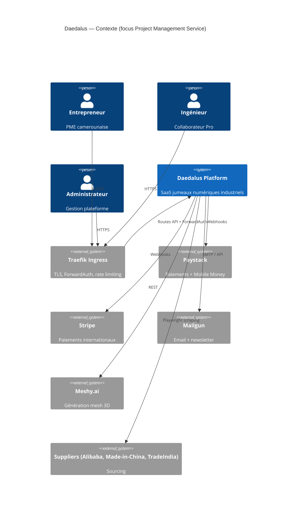

# C4 — Niveau 1 : Contexte système

```mermaid
C4Context
    title Daedalus — Contexte (focus Project Management Service)

    Person(entrepreneur, "Entrepreneur", "PME camerounaise")
    Person(engineer,     "Ingénieur",    "Collaborateur Pro")
    Person(admin,        "Administrateur", "Gestion plateforme")

    System(daedalus, "Daedalus Platform", "SaaS jumeaux numériques industriels")

    System_Ext(traefik, "Traefik Ingress", "TLS, ForwardAuth, rate limiting")
    System_Ext(paystack, "Paystack",   "Paiements + Mobile Money")
    System_Ext(stripe,   "Stripe",     "Paiements internationaux")
    System_Ext(mailgun,  "Mailgun",    "Email + newsletter")
    System_Ext(meshy,    "Meshy.ai",   "Génération mesh 3D")
    System_Ext(suppliers,"Suppliers (Alibaba, Made-in-China, TradeIndia)", "Sourcing")

    Rel(entrepreneur, traefik, "HTTPS")
    Rel(engineer,     traefik, "HTTPS")
    Rel(admin,        traefik, "HTTPS")
    Rel(traefik, daedalus, "Routes API + ForwardAuth")
    Rel(daedalus, paystack, "Webhooks")
    Rel(daedalus, stripe,   "Webhooks")
    Rel(daedalus, mailgun,  "SMTP / API")
    Rel(daedalus, meshy,    "REST")
    Rel(daedalus, suppliers,"Playwright scraping")
```
