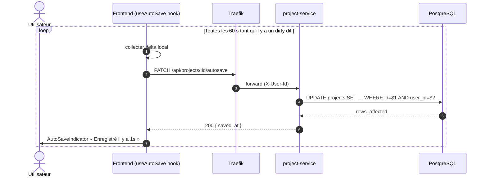

# Séquence — Auto-sauvegarde (PB-017, toutes les 60 s)

```mermaid
sequenceDiagram
    autonumber
    actor U as Utilisateur
    participant FE as Frontend (useAutoSave hook)
    participant TR as Traefik
    participant PS as project-service
    participant DB as PostgreSQL

    loop Toutes les 60 s tant qu'il y a un dirty diff
        FE->>FE: collecter delta local
        FE->>TR: PATCH /api/projects/:id/autosave
        TR->>PS: forward (X-User-Id)
        PS->>DB: UPDATE projects SET … WHERE id=$1 AND user_id=$2
        DB-->>PS: rows_affected
        PS-->>FE: 200 { saved_at }
        FE->>U: AutoSaveIndicator « Enregistré il y a 1s »
    end
```
