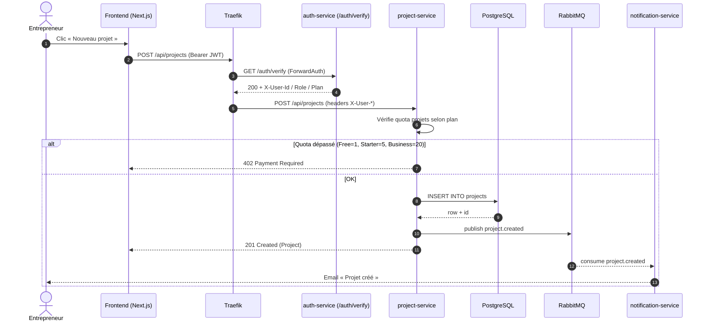

# Séquence — Création d'un projet

```mermaid
sequenceDiagram
    autonumber
    actor U as Entrepreneur
    participant FE as Frontend (Next.js)
    participant TR as Traefik
    participant AU as auth-service (/auth/verify)
    participant PS as project-service
    participant DB as PostgreSQL
    participant MQ as RabbitMQ
    participant NS as notification-service

    U->>FE: Clic « Nouveau projet »
    FE->>TR: POST /api/projects (Bearer JWT)
    TR->>AU: GET /auth/verify (ForwardAuth)
    AU-->>TR: 200 + X-User-Id / Role / Plan
    TR->>PS: POST /api/projects (headers X-User-*)
    PS->>PS: Vérifie quota projets selon plan
    alt Quota dépassé (Free=1, Starter=5, Business=20)
        PS-->>FE: 402 Payment Required
    else OK
        PS->>DB: INSERT INTO projects
        DB-->>PS: row + id
        PS->>MQ: publish project.created
        PS-->>FE: 201 Created (Project)
        MQ-->>NS: consume project.created
        NS-->>U: Email « Projet créé »
    end
```
